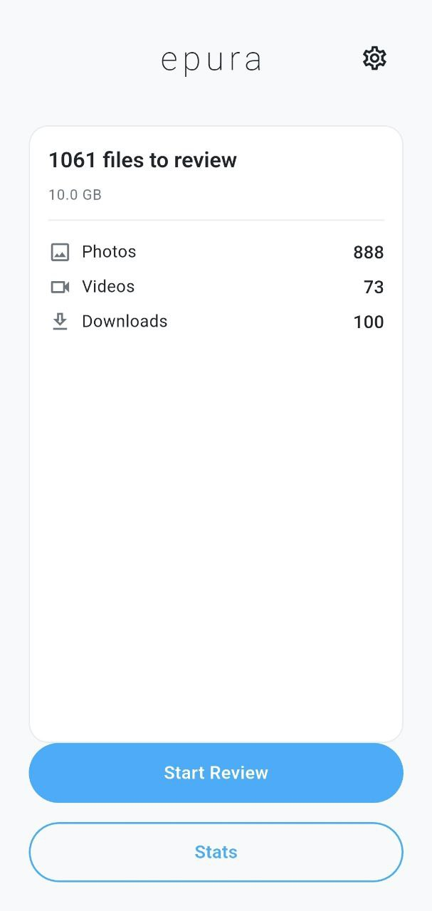
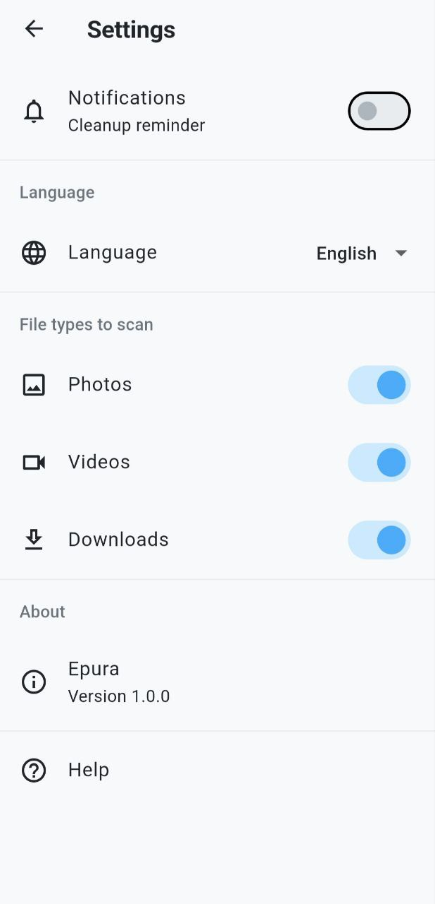

# Epura

A minimal Android app that reminds you to periodically review recently added photos, videos, and downloads. Decide whether to keep or delete each file via a swipe-card interface to prevent storage bloat from forgotten files.

## Features

- **Swipe to decide** — swipe right to keep, left to delete, or skip for later
- **Smart scanning** — scans photos, videos, and downloads filtered by a configurable lookback period
- **Daily reminders** — configurable notification time with option to disable
- **Stats & streaks** — track total storage freed, weekly progress, and review streaks
- **Bilingual** — English and French, follows device locale with manual override
- **Lookback picker** — choose how far back to scan (1, 3, 7, 14, or 30 days) before each review

## Screenshots

<p align="center">
  
  
</p>

## Getting Started

### Prerequisites

- Flutter SDK (stable channel)
- Android SDK with minimum API level 21

### Build & Run

```bash
flutter pub get
flutter run
```

### Build Release APK

```bash
flutter build apk --release
```

The APK will be at `build/app/outputs/flutter-apk/app-release.apk`.

## Architecture

- **State management**: Provider (ChangeNotifier)
- **Database**: SQLite via sqflite (review session history)
- **Notifications**: flutter_local_notifications with timezone support
- **Media access**: photo_manager
- **Localization**: Flutter's built-in ARB/intl system

### Project Structure

```
lib/
  main.dart              # App bootstrap
  app.dart               # MaterialApp with routes and i18n
  l10n/                  # ARB translation files (en, fr)
  models/                # ReviewItem, ReviewSession
  providers/             # FileService, ReviewProvider, SettingsProvider, StatsProvider
  screens/               # Home, Review, Summary, Settings, Stats
  services/              # DatabaseService, NotificationService, ThumbnailCache
  theme/                 # AppTheme (colors, spacing, typography)
  utils/                 # formatBytes utility
  widgets/               # ReviewCard, FilePreview, EmptyState, LookbackPicker, StatCard
```

## CI/CD

Pushing a `v*` tag triggers the GitHub Actions workflow, which builds a release APK and creates a GitHub Release with the artifact `epura-<tag>.apk`.

### Releasing a new version

1. **Bump the version** in `pubspec.yaml` (line `version:`):

   ```yaml
   # Format: <major>.<minor>.<patch>+<build-number>
   version: 1.1.0+2
   ```

   - `build-name` (e.g. `1.1.0`) — displayed to users, follows semver
   - `build-number` (e.g. `2`) — must be strictly incremented for each release uploaded to the Play Store

2. **Commit the version bump:**

   ```bash
   git add pubspec.yaml
   git commit -m "chore: bump version to 1.1.0+2"
   ```

3. **Tag and push:**

   ```bash
   git tag v1.1.0
   git push origin master --tags
   ```

   This triggers the CI workflow. Once it completes, a GitHub Release named `v1.1.0` is created with `epura-v1.1.0.apk` attached.

### What the workflow does

1. Checks out the code
2. Runs `flutter analyze`
3. Builds a release APK (`flutter build apk --release`)
4. Renames the APK to `epura-<tag>.apk`
5. Creates a GitHub Release with auto-generated release notes

## Permissions

- `READ_MEDIA_IMAGES` / `READ_MEDIA_VIDEO` — access device gallery
- `MANAGE_EXTERNAL_STORAGE` — scan Downloads folder
- `POST_NOTIFICATIONS` — daily reminder notifications
- `SCHEDULE_EXACT_ALARM` — schedule notifications at specific times

## License

MIT
